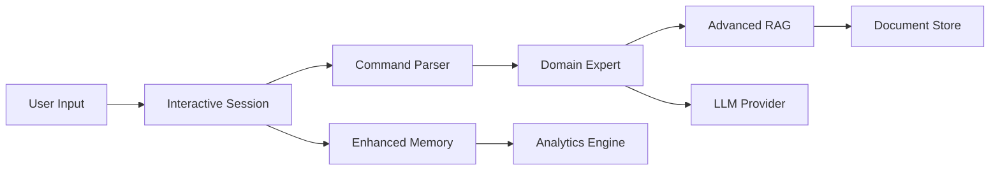

# AI Tutoring System with Advanced RAG and Multi-LLM Support

An intelligent tutoring system that adapts to individual learning patterns, uses advanced document retrieval, and supports multiple LLM providers.

## 🚀 Key Features

### 1. **Interactive Learning Sessions**
- **Dynamic Commands**: Use commands like `!help`, `!ask`, `!pause` at any time during learning
- **Session Persistence**: Pause and resume sessions with full state preservation
- **Real-time Adaptation**: System adjusts to your performance and questions in real-time

### 2. **Advanced RAG System**
- **Hybrid Search**: Combines semantic search (dense embeddings) with keyword search (BM25)
- **Reranking**: Uses cross-encoder models for improved relevance
- **Smart Chunking**: Context-aware document chunking with overlap
- **Citation Tracking**: Every answer includes proper citations to source documents

### 3. **Multi-LLM Support**
- **OpenAI**: GPT-4, GPT-3.5
- **DeepSeek**: Open-source alternative
- **Ollama**: Run models locally
- **Anthropic**: Claude models
- **Google**: Gemini models

### 4. **Enhanced Memory System**
- **Pattern Analysis**: Tracks learning patterns, optimal study times, and error types
- **Personalized Recommendations**: Suggests optimal session length and study schedule
- **Spaced Repetition**: Automatically schedules reviews based on forgetting curve
- **Detailed Analytics**: Comprehensive insights into your learning progress

## 📋 Installation

1. **Clone the repository**:
```bash
git clone <repository-url>
cd LLM_GIS
```

2. **Install dependencies**:
```bash
pip install -r requirements.txt
```

3. **Set up API keys** (for LLM providers):
```bash
# Option 1: Environment variables
export OPENAI_API_KEY="your-key-here"
export DEEPSEEK_API_KEY="your-key-here"

# Option 2: Use .env file
echo "OPENAI_API_KEY=your-key-here" >> .env
```

4. **Add your documents**:
- Place PDF and text files in the `docs/` folder
- The system will automatically process and index them

## 🎯 Usage

### Starting the System
```bash
python main.py
```

### Available Modes

1. **Learn Mode**: Interactive learning with the new command system
   - Choose between interactive (recommended) or traditional mode
   - Use commands during session: `!help`, `!ask question`, `!pause`, etc.

2. **Review Mode**: Focused review of weak areas
   - Automatically identifies topics needing review
   - Intensive practice on specific weaknesses

3. **Test Mode**: Assessment with automatic grading
   - Questions generated from your documents
   - Performance tracked in memory system

4. **Insights Mode**: View detailed analytics
   - Learning patterns and optimal study times
   - Personalized recommendations
   - Spaced repetition schedule

5. **LLM Mode**: Manage language model providers
   - Switch between providers
   - Add API keys
   - Test provider connections

6. **Sources Mode**: View document statistics
   - See indexed documents
   - Check RAG system status

### Interactive Commands (During Learning)

| Command | Description |
|---------|-------------|
| `!help` | Show available commands |
| `!explain` | Get more detailed explanation |
| `!example` | See another example |
| `!hint` | Get a hint for current question |
| `!skip` | Skip current topic |
| `!pause` | Pause and save session |
| `!ask [question]` | Ask a specific question |
| `!difficulty [level]` | Adjust difficulty (easy/medium/hard) |
| `!progress` | View current progress |
| `!quit` | End session |

## 🏗️ System Architecture

### Core Components

1. **Domain Expert** (`domain_expert.py`)
   - Handles all content generation (explanations, examples, questions)
   - Integrates with advanced RAG system
   - Supports multiple LLM providers

2. **Planner Agent** (`planner.py`)
   - Creates structured learning plans
   - Manages prerequisites and progression
   - Purely structural, delegates content to domain expert

3. **Interactive Session** (`interactive_session.py`)
   - Manages dynamic user interactions
   - Handles command parsing and execution
   - Maintains session state

4. **Advanced RAG** (`advanced_rag.py`)
   - Hybrid retrieval (dense + sparse)
   - Document processing and chunking
   - Reranking for better relevance

5. **Enhanced Memory** (`enhanced_memory.py`)
   - Deep learning analytics
   - Pattern recognition
   - Personalized recommendations

6. **LLM Providers** (`llm_providers.py`)
   - Unified interface for multiple LLMs
   - Easy provider switching
   - Fallback handling

### Data Flow



## 🔧 Configuration

### LLM Configuration (`llm_config.json`)
```json
{
  "default_provider": "openai",
  "providers": {
    "openai": {
      "model": "gpt-4",
      "enabled": true
    },
    "deepseek": {
      "model": "deepseek-chat",
      "enabled": true
    }
  }
}
```

### Adding Documents
1. Place PDFs or text files in `docs/` folder
2. Restart the application
3. Documents are automatically indexed with citations

## 🚀 Advanced Features

### Custom Question Generation
The system generates different types of questions:
- **Conceptual**: Tests understanding of key concepts
- **Analytical**: Requires critical thinking
- **Application**: Practical scenarios
- **Synthesis**: Combines multiple concepts

### Learning Analytics
- **Optimal Study Time**: Identifies when you perform best
- **Session Length**: Recommends ideal study duration
- **Error Patterns**: Analyzes types of mistakes
- **Progress Tracking**: Visualizes learning trajectory

### Spaced Repetition
- Automatic scheduling based on performance
- Priority-based review suggestions
- Tracks retention over time

## 🤝 Contributing

1. Fork the repository
2. Create a feature branch
3. Make your changes
4. Submit a pull request

## 📄 License

[Your License Here]

## 🙏 Acknowledgments

- OpenAI for GPT models
- Sentence Transformers for embeddings
- FAISS for efficient similarity search

```
python main.py
```

Set the environment variable `OPENAI_API_KEY` if you want to query OpenAI.
Without it, stub responses will be returned.

The planner is implemented as an agent that queries the domain expert LLM to
create learning plans and drive teaching loops. The domain expert includes a
minimal retrieval step that pulls text snippets from the `docs/` directory and
injects them into prompts (a lightweight RAG approach). If no API key is
provided or parsing fails, defaults from `topics.json` are used.
